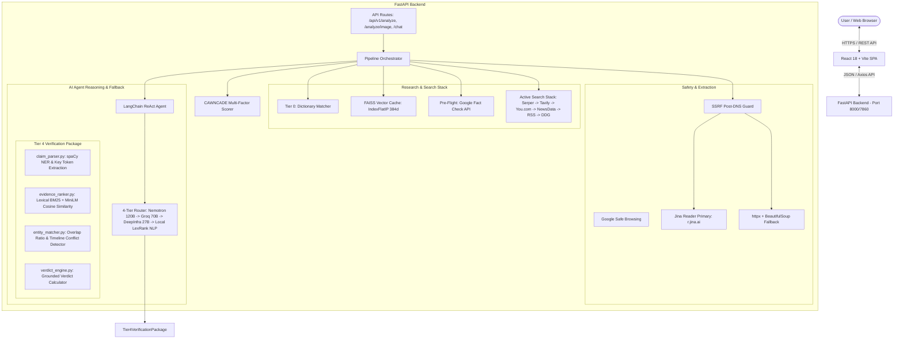
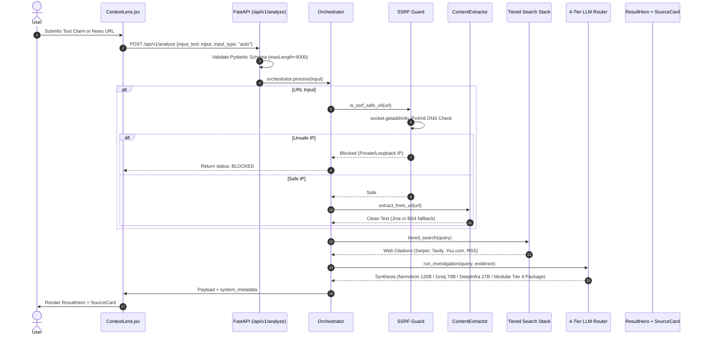
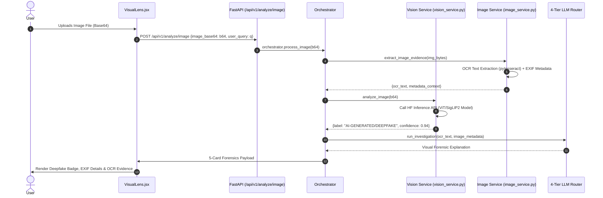
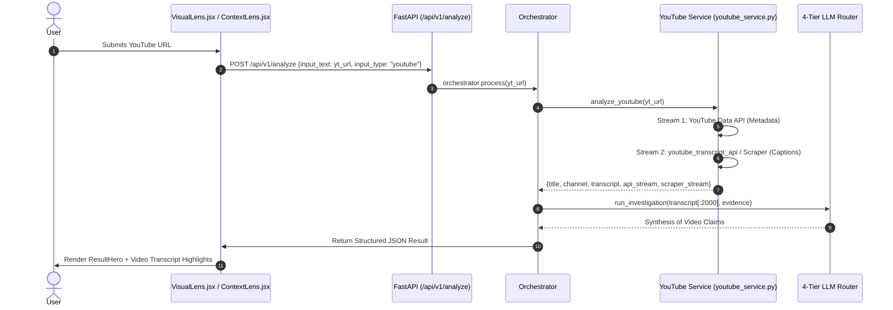
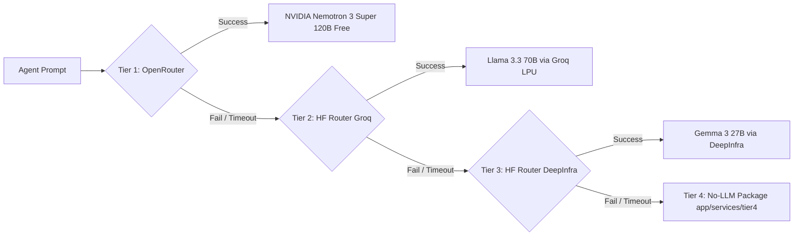

# CAWNCADE AI — Living Project Architecture Documentation

**Context Aware Watch News Confirmation Authenticity Detection Engine (v3.5)**  
*Single Source of Truth for Application Architecture, Verification Pipelines, Security Model, LLM Routing, Failure Flowcharts, and Testing Strategy.*

---

## Table of Contents
1. [Project Overview](#1-project-overview)
2. [Global System Architecture](#2-global-system-architecture)
3. [Decoupled Input Pipeline Architectures](#3-decoupled-input-pipeline-architectures)
   - [3.1 Global Input Classifier Router](#31-global-input-classifier-router)
   - [3.2 ContextLens Pipeline (Text & URLs)](#32-contextlens-pipeline-text--urls)
   - [3.3 VisualLens Pipeline (Images & Forensics)](#33-visuallens-pipeline-images--forensics)
   - [3.4 YouTube Pipeline (Dual-Stream Transcripts)](#34-youtube-pipeline-dual-stream-transcripts)
4. [Failure-State & Resiliency Flowcharts](#4-failure-state--resiliency-flowcharts)
5. [Extraction Result State Machine](#5-extraction-result-state-machine)
6. [Backend Architecture & Modular `tier4/` Package](#6-backend-architecture--modular-tier4-package)
7. [Frontend Architecture](#7-frontend-architecture)
8. [LLM Provider Architecture & Tier 4 No-LLM Verification Engine](#8-llm-provider-architecture--tier-4-no-llm-verification-engine)
9. [Extraction Architecture](#9-extraction-architecture)
10. [Security Architecture](#10-security-architecture)
11. [Rate Limiting & Resilience Architecture](#11-rate-limiting--resilience-architecture)
12. [Verification Matrix](#12-verification-matrix)
13. [User Use Cases](#13-user-use-cases)
14. [Deployment Architecture](#14-deployment-architecture)
15. [Performance & Latency Budget](#15-performance--latency-budget)
16. [Architecture Update Policy](#16-architecture-update-policy)

---

## 1. Project Overview

CAWNCADE AI is a multi-tiered, fault-tolerant news verification platform and claim-analysis engine. It cross-references user claims, news URLs, YouTube videos, and images against multi-vector web sources, historical fact-check databases, domain trust registries, and an autonomous ReAct AI reasoning agent.

### Supported Inputs
- **Text Claims**: Raw text statements, news excerpts, or viral social media posts (Up to 5,000 characters).
- **Article URLs**: News article links validated against SSRF protection rules and parsed via a hybrid extraction pipeline.
- **YouTube URLs**: YouTube video links processed via dual-stream API and transcript extraction (`youtube_service.py`).
- **Images**: Visual files analyzed via HuggingFace Inference API vision models (ViT/SigLIP2) and local OCR pre-processing (`image_service.py`).

### Verified Tech Stack (Codebase Reality Audit)
- **Frontend**: React 18, Vite, Tailwind CSS, Framer Motion, Lucide Icons.
- **Backend**: FastAPI (Python 3.11), Uvicorn, Pydantic v2.
- **Extraction Engine**: Jina Reader API (Primary) + `httpx` / `BeautifulSoup4` (Secondary Fallback).
- **LLM Reasoning Cascade**:
  1. Tier 1: OpenRouter (`nvidia/nemotron-3-super-120b-a12b:free`)
  2. Tier 2: HuggingFace Router Groq (`meta-llama/Llama-3.3-70B-Instruct:groq`)
  3. Tier 3: HuggingFace Router DeepInfra (`google/gemma-3-27b-it:deepinfra`)
  4. Tier 4: No-LLM Verification Package (`app/services/tier4/`)
- **Search Stack (Active Engines)**:
  - Serper.dev Google API (Tier 1)
  - Tavily AI Search + You.com Index API (Tier 2)
  - NewsData.io (Tier 3)
  - Google News RSS (Tier 4)
  - DuckDuckGo Fallback (Tier 5)
  *(Note: Non-functional legacy Google CSE is explicitly excluded)*
- **Semantic Vector Cache**: FAISS (`faiss-cpu`) + `sentence-transformers/all-MiniLM-L6-v2` (`app/services/cache_service.py`).
- **Resilience**: Custom state-machine CircuitBreaker (`app/core/resilience.py`), Tenacity exponential backoff retries.

---

## 2. Global System Architecture



---

## 3. Decoupled Input Pipeline Architectures

### 3.1 Global Input Classifier Router

```
                 User Input
                     |
                     ↓
            Input Classifier (orchestrator.py)
                     |
        +------------+------------+------------------+
        |                         |                  |
    Text Claim                Article URL        Image Upload / YouTube
        |                         |                  |
        ↓                         ↓                  ↓
  ContextLens              SSRF Security Guard   VisualLens
 (Direct Analysis)                |             (OCR / Vision Model)
                                  ↓
                        Hybrid Extractor
                        (Jina -> BS4 Fallback)
```

---

### 3.2 ContextLens Pipeline (Text & URLs)



---

### 3.3 VisualLens Pipeline (Images & Forensics)



---

### 3.4 YouTube Pipeline (Dual-Stream Transcripts)



---

## 4. Failure-State & Resiliency Flowcharts

```
               Input URL
                  |
                  |
             SSRF Check (safe_browsing_service.py)
                  |
          -----------------
          |               |
        Safe            Blocked (Private/Loopback IP)
          |               |
          |          Security Block UI (status: BLOCKED)
          |
       Jina Reader (r.jina.ai)
          |
     ---------------
     |             |
 Success        Failure / Timeout (>15s)
     |             |
 Evidence      httpx + BeautifulSoup4 (5MB Cap)
                |
           -------------
           |           |
        Success     Paywall / Failed
           |           |
       Continue    Slug Keyword Extractor
                    + Web Search Citations
```

---

## 5. Extraction Result State Machine

Instead of crashing or returning opaque `500` errors, CAWNCADE classifies extraction outcomes into structured state codes:

| State Code | Trigger Condition | System Behavior | User-Facing UI Message |
| :--- | :--- | :--- | :--- |
| **`SUCCESS`** | Article text extracted cleanly (>=1000 chars). | Proceeds directly to LLM & 3-Way Evidence Compression. | Rendered in dominant `ResultHero` card. |
| **`PAYWALL`** | HTTP 401/403/451 or subscription wall detected. | Engages slug keyword extraction + web search citations. | `⚠️ Article restricted by paywall. Verification performed via multi-source web citations.` |
| **`TIMEOUT`** | Server connection > 15 seconds. | Aborts fetch; falls back to search evidence. | `⚠️ Target website did not respond within 15 seconds. Using web search citations.` |
| **`BLOCKED`** | SSRF Guard intercepts private/loopback IP. | Blocks request before network connection. | `❌ Security Warning: Target URL is restricted from server-side fetching.` |
| **`INVALID_URL`**| Malformed string or non-HTTP(S) scheme. | Prompts user or treats input as plain text claim. | `❌ Invalid URL format. Please paste a valid news article URL.` |
| **`NO_CONTENT`** | Body tag empty or script-only page. | Engages Jina Reader or prompts for raw text paste. | `⚠️ Unable to extract article text. Please paste the article text directly.` |

---

## 6. Backend Architecture & Modular `tier4/` Package

```
backend/app/
├── api/
│   └── routes/
│       ├── admin.py         # System health & telemetry endpoints
│       ├── analysis.py      # Core analysis routes (/analyze, /analyze/image, /feedback)
│       └── auth.py          # Authentication routes
├── config/
│   └── settings.py          # Type-safe environment settings (Pydantic BaseSettings)
├── core/
│   ├── cache.py             # Global memory cache
│   ├── orchestrator.py      # Master pipeline coordinator with system_metadata tracking
│   ├── rate_limiter.py      # Sliding window rate limiter
│   ├── resilience.py        # Custom state-machine CircuitBreaker (CLOSED->OPEN->HALF_OPEN)
│   ├── security.py          # JWT authentication helpers
│   └── trusted_domains.py   # Walled garden domain registry (50+ trusted sites)
├── services/
│   ├── agent_service.py     # ReAct LLM agent & 4-tier provider router (with telemetry)
│   ├── cache_service.py     # FAISS CPU vector cache (SentenceTransformers)
│   ├── dictionary_matcher.py# Tier 0 local viral claim cache
│   ├── fact_check_service.py# Google Fact Check API integration
│   ├── news_service.py      # Multi-tier web search engine (Serper, Tavily, You.com, NewsData, RSS, DDG)
│   ├── offline_nlp_service.py # Backward compatibility wrapper for app.services.tier4
│   ├── safe_browsing_service.py # Google Safe Browsing & SSRF DNS guard
│   ├── tier4/               # Modular Tier 4 Verification Package
│   │   ├── __init__.py
│   │   ├── claim_parser.py  # Claim decomposition & spaCy NER
│   │   ├── evidence_ranker.py # Hybrid BM25 + MiniLM Cosine Similarity ranker
│   │   ├── entity_matcher.py# Overlap Ratio & Year conflict detector
│   │   ├── verdict_engine.py# Deterministic grounded verdict calculator
│   │   ├── summarizer.py    # Extractive Sumy LexRank summarizer
│   │   └── verification_service.py # Tier 4 Orchestration Master Service
│   ├── vision_service.py    # HF Inference ViT/SigLIP2 deepfake analysis
│   └── youtube_service.py   # YouTube API & transcript scraper
└── utils/
    ├── helpers.py           # Recency & date helpers
    └── logger.py            # Structured logging
```

---

## 7. LLM Provider Architecture & Tier 4 No-LLM Verification Engine

CAWNCADE AI implements a 4-tier fault-tolerant LLM router cascade:



### Provider Cascade Policy
- **Primary (Tier 1)**: OpenRouter `nvidia/nemotron-3-super-120b-a12b:free` for high-parameter multi-step ReAct reasoning.
- **Fallback 1 (Tier 2)**: Hugging Face Router Meta Llama 3.3 70B Instruct via Groq LPU engine.
- **Fallback 2 (Tier 3)**: Hugging Face Router Google Gemma 3 27B via DeepInfra engine.
- **Fallback 3 (Tier 4)**: Local CPU Deterministic Verification Package (`app/services/tier4/`) when all online LLM endpoints are unreachable.

### Verified Code Implementations
- **Claim Parser**: `claim_parser.py` decomposes user input into linguistic components via `spaCy`.
- **Hybrid Ranker**: `evidence_ranker.py` combines `BM25Okapi` lexical matching with `SentenceTransformer("all-MiniLM-L6-v2")` cosine similarity.
- **Entity Matcher**: `entity_matcher.py` detects 4-digit year timeline conflicts and entity overlap ratios.
- **Verdict Engine**: `verdict_engine.py` outputs grounded verdicts (`SUPPORTED BY AVAILABLE EVIDENCE`, `CONTRADICTED BY AVAILABLE EVIDENCE (DATE / TIMELINE MISMATCH)`, `MIXED / PARTIALLY SUPPORTED EVIDENCE`).

---

## 8. Verification Matrix

| Component / Feature | Code Location | Verified Test Suite | Expected Production Output |
| :--- | :--- | :--- | :--- |
| **SSRF Post-DNS Guard** | [safe_browsing_service.py](file:///C:/Users/ks919/Downloads/CAWNCADE%20AI/backend/app/services/safe_browsing_service.py#L20-L50) | Input `http://localhost:8000/admin` | Returns `(False, "Security Block: Access to local network prohibited.")` |
| **Jina Primary Extractor** | [extractor.py](file:///C:/Users/ks919/Downloads/CAWNCADE%20AI/backend/app/modules/extraction/extractor.py#L34-L65) | URL submit via ContextLens | `method: "jina_reader"`, text >= 1000 chars, status: `SUCCESS` |
| **5MB Response Byte Cap** | [extractor.py](file:///C:/Users/ks919/Downloads/CAWNCADE%20AI/backend/app/modules/extraction/extractor.py#L70-L85) | Stream byte count check | Aborts download if > 5MB; returns size cap warning. |
| **FAISS Vector Cache** | [cache_service.py](file:///C:/Users/ks919/Downloads/CAWNCADE%20AI/backend/app/services/cache_service.py#L60-L90) | Submit identical claim | `< 50ms` Instant Cache Hit with `confidence_label: "CACHED"` |
| **Tier 4 Verification Package**| [verification_service.py](file:///C:/Users/ks919/Downloads/CAWNCADE%20AI/backend/app/services/tier4/verification_service.py) | [test_tier4_fallback.py](file:///C:/Users/ks919/Downloads/CAWNCADE%20AI/backend/tests/test_tier4_fallback.py) | `model_used: "local_lexrank_nlp"`, BM25 + MiniLM ranked evidence, spaCy entities, & deterministic verdict |
| **Deepfake Detection** | [vision_service.py](file:///C:/Users/ks919/Downloads/CAWNCADE%20AI/backend/app/services/vision_service.py#L16-L65) | Image upload via VisualLens | `normalized: "AI-GENERATED/DEEPFAKE"` with score confidence % |
| **YouTube Transcript** | [youtube_service.py](file:///C:/Users/ks919/Downloads/CAWNCADE%20AI/backend/app/services/youtube_service.py#L15-L60) | YouTube URL submit | Dual-stream API + Scraper transcript text extraction |

---

## 9. Performance & Latency Budget

- **Instant Path (Cache Hit)**: `< 50ms` via FAISS CPU vector lookup (`app/services/cache_service.py`).
- **Fast Path (Cached Search + Direct LLM)**: `5 - 10 seconds`.
- **Standard Pipeline Path (Full Search + Jina Extraction + LLM)**: `10 - 20 seconds`.
- **Maximum Bound (Cascading LLM Router + Web Retries)**: `30 - 60 seconds`.
- **Memory Cap**: Stream caps enforce a strict **5MB limit** per HTTP request.

---

## 10. Architecture Update Policy

> ### ⚠️ ARCHITECTURE UPDATE POLICY
> **This document (`docs/ARCHITECTURE.md`) is a living specification.**  
> Whenever any of the following items are added, modified, or refactored in the repository:
> 1. API routes or Pydantic schemas (`app/api/routes/`)
> 2. LLM providers or prompt templates (`app/services/agent_service.py`)
> 3. Extraction algorithms or scraper tools (`app/modules/extraction/`)
> 4. Security layers or SSRF rules (`app/services/safe_browsing_service.py`)
> 5. Frontend component primitives or page layouts (`frontend/src/`)
> 
> **The developer or AI agent performing the update MUST update `docs/ARCHITECTURE.md` to reflect the changes prior to marking the task complete.**
